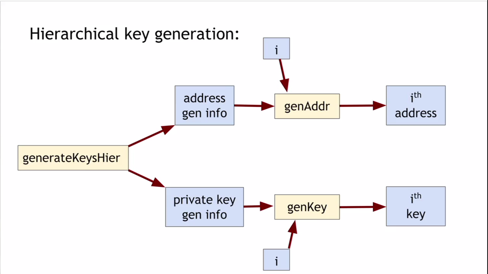
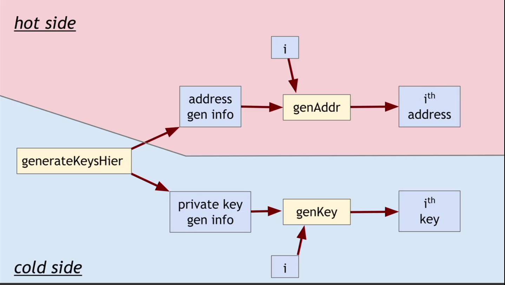

# Week4 How to Store and Use ~~Bitcoins~~ Secret Keys

이번 주는 비크코인을 어떻게 저장하고 사용하는지 살펴본다.

## Simple Local Storage

비트코인을 소비하기 위해서는 2가지를 알아야 한다.

* 공용 블록체인으로 부터의 정보
* 소유주의 서명된 비밀 키

키를 저장하고 관리하는데에는 3가지 목표가 있다.

* 가용성(availability): 내 코인을 소비할 수 있다.
* 보안(security): 그 누구도 내 코인을 소비할 수 없다.
* 편리성(convenience)

아주 간단한 방법은 키를 파일으로 내 컴퓨터나 장치에 저장하는 것이다. 아주 간편하지만 몇 가지 문제가 있다. 디바이스에 저장된 키가 날아가면 나는 코인을 잃게 된다. 또한 보안에도 취약하다. 키가 탈취되면 코인도 도둑맞게 된다.

그래서 실제로는 키의 상세정보 전체를 편리하게 관리하기 위해 지갑 소프트웨어를 사용한다. 지갑은 코인을 추적해주고 훌륭한 사용자 인터페이스를 제공한다. 각각의 코인을 분리해서 관리하기도 좋다.

지불이 일어날 때 주소를 지갑의 주고 받을 수 있고, 문자열을 이용하는 방법과 QR코드를 이용하는 방법 두가지가 있다. 이 문자열은 base 58로 인코딩하고, 인코딩한 문자열을 사용하여 58 숫자를 인코딩한다.

## Hot and Cold Storage

Hot storage는 온라인이다. 편리하지만 약간 위험하다. Cold storage는 오프라인이다. 인터넷에 연결되어 있지 않고 잠겨 있다. 더 안전하지만 편리하진 않다.

이 강의의 주요 주제는 Hot과 Cold 사이에 코인을 어떻게 옮길 것인가에 대한 것과 관계에 대한 것이다.

각 지갑에는 각각의 비밀키가 존재한다. 그리고 양쪽에서는 다른 쪽의 주소를 알아야 한다.

실제로 Cold Storage는 온라인이 아니어서 네트워크로는 연결할 수 없다. 오프라인이어도 Hot storage가 Cold Storage의 주소를 알고 있어서 코인을 보낼 수 있다. 그래서 아무때나 코인을 Hot에서 Cold로 보낼 수 있다. 

코인을 Hot에서 Cold로 옮길 때면 목적에 의해서 최신의 cold address 를 사용해야 한다. 그래서 Hot Storage에서 그 주소를 알아낼 방법을 알아야 있어야 한다.

문제:  want to use a new address (and key) for each coin sent to cold. But how can hot wallet learn new addresses if cold wallet is offline?

어색한 해결책: Generate a bit batch of addresses/keys, transfer to hot beforehand

더 좋은 해결책 : Hierarchical wallet

이전에 키 생성에서 살펴보면 공개키, 비밀키가 있는데, 공개키는 비트코인을 주고 받을 주소로 사용되고, 비밀키는 코인을 소비하거나 제어하기 위해 사용된다.

계층적 지갑에서의 키 생성은 조금 다르다

getKeysHier -> address get info + private key gen info

이를 이용해서 다수의 키를 생성할 수 있다.



장점은 다수의 키가 인덱스를 통해서 매칭 된다는 점이다. 또한 주소 생성 정보(address get info)가 키를 노출하지 않는다.

모든 전자서명에서 이 기능을 지원하는 것은 아니지만 비트코인에서 사용하는 ECDSA에서는 지원한다.

그래서 hot 영역과 cold 영역을 구분하면 아래와 같다.



how to store cold info

(1) Info stored in devide, device locked in a safe
(2) "Brain wallet": encrypt info under passphrase that user remembers
(3) Paper wallet: print info on paper, lock up the paper
(4) In "tamperproof" device: device will sign things for you, but won't divulge keys


## Splitting and Sharing Keys

// TBD

## Online Wallets and Exchanges

// TBD

## Payment Services

비트코인에서 상인이 지불을 승인하는 방법에 대해 알아보자.

시나리오는 상인이 있고 가격을 비트코인으로 지불하는 것이다. 상인이 원하는 것은 최종 결제는 달러나 불환지폐(fiat currency)를 받는 것이다.

상인들은 비트코인으로 지불 받을 방법을 원하지만 웹사이트나 영업 활동을 신설하는 기술적 변화에 대해 우려한다. 또한 위험하지 않길 바란다. 지갑이 분실되거나 직원이 비트코인을 가지고 튀는 등의 위험에 대해 걱정한다.

또한 비트코인을 달러로 바꿀때 환율에 대한 리스크도 원치 않는다.

이러한 이유로 지불 서비스가 있다.

```
(1) merchant -> user: Pay with BTC button <transId, amount>
(2) user -> payment service: clicked <transId, amount>
(3) payment service <-> user: payment interaction
(4) payment service -> metchant: redirect & ok so far
(5) payment service -> merchant: confirm <transId, amount>
(6) merchant -> user: shipped goods
```

최종 결과는 아래와 같다

* 소비자: 비트코인 지불
* 상인: 달러를 받음. 약간 손해(;수수료))
* 지불 서비스 : 비트코인 받음, 달러 지불(;수수료 약간), 리스크 흡수(보안, 환율)

## Transcation Fees

거래 비용은 비트코인에서 중요한 요소이며, 이전에도 다루었고 앞으로도 등장한다. 이번에 이야기 할 것은 비트코인에 어떻게 설정되는가에 대한 이야기 이다.

이전에 저장소, 지불 서비스, 교환에 대해 알아봤다.

거래 비용은 input의 가치에서 out의 가치를 제외한 값이다. 이 비용을 트랜젝션을 기록한 마이너에게 지불된다.

비용은 거래를 전달한 피어와 트렌젝션을 기록한 마이너에게 돌아간다. 거래 비용은 이에 대한 보상이다.

일반적으로 거래 비용이 높으면 트랜젝션은 더 빨리 기록되고 전파된다.

```
No fee if
  tx less than 1000 bytes in size,
  all outputs are 0.01 BTC or larger, and
  priority is large enough

Priority = (sum of inputAge * inputValue) / ( trans size)

Otherwise fee is 0.001 BTC per 1000 bytes

approx transaction size: 148 N inputs + 34N outputs + 10
```

대부분의 광부들은 합의 비용 구조를 강요한다.

합의 비용을 지불하지 않으면 거래가 기록될 때까지 더 오래 걸린다.

마이너는 수수료 및 우선 순위 수식에 따라 거래 순위를 정한다.

## Currency Exchange Markets

// TBD